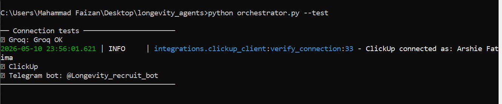
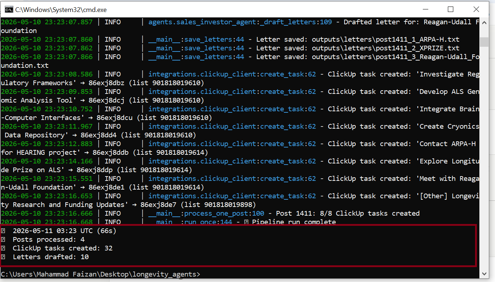
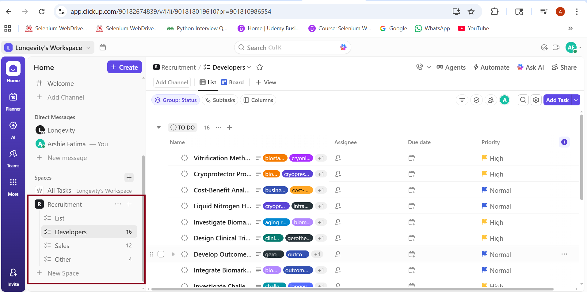

# 🧬 Longevity Multi-Agent Pipeline

An autonomous multi-agent AI system that monitors longevity science news from Telegram, parses articles using LLaMA AI, and automatically creates structured tasks in ClickUp for developer and sales teams.

> Built as a test task for CureForge AI / Longevity InTime — targeting the cure for aging before 2030.

---

## ✅ Connection Test



All 3 services connected and verified:
- ✅ Groq AI (LLaMA 3.3 70B)
- ✅ ClickUp (connected as Arshie Fatima)
- ✅ Telegram Bot (@Longevity_recruit_bot)

---

## 🚀 Live Results



| Metric | Result |
|---|---|
| Posts processed | 4 articles |
| ClickUp tasks created | 32 tasks |
| Investor letters drafted | 10 letters |
| Pipeline runtime | ~66 seconds |

---

## 📋 ClickUp Tasks Created



Tasks automatically routed to the correct department lists:
- **Developers** → 16 research tasks
- **Sales** → 12 investor outreach tasks
- **Other** → 4 general tasks

---

## 🏗️ Architecture

```
@UkhvatNews (Telegram)
        ↓
  Telegram Monitor      ← reads forwarded posts via Bot API
        ↓
  Article Parser Agent  ← Groq/LLaMA 3.3 70B extracts structured insights
        ↓
  ┌─────┴─────────────────┐
  │                       │
Dev Task Agent     Sales/Investor Agent
  │                       │
  └──────┬────────────────┘
         ↓
   ClickUp Tasks    → Developers / Sales / Other lists
         +
   Investor Letters → saved to outputs/letters/
         +
   Telegram Status  → summary sent to your Telegram after each run
```

---

## 🤖 Agents

### 1. Telegram Monitor
- Reads posts forwarded to the bot via Telegram Bot API
- Tracks last-seen post IDs to avoid reprocessing
- Supports daemon mode — polls every 5 minutes automatically

### 2. Article Parser Agent
- Uses Groq (LLaMA 3.3 70B) to read each longevity article
- Extracts: title, summary, research tasks, funding opportunities, target organisations, relevant departments
- Returns structured JSON for downstream agents

### 3. Developer Task Agent
- Turns research insights into actionable ClickUp tasks
- Assigns priorities (urgent/high/normal/low) and relevant tags
- Routes tasks to the Developers list

### 4. Sales / Investor Agent
- Identifies funding opportunities and target organisations
- Generates ClickUp tasks for the sales team
- Drafts personalised outreach emails to investors and grant bodies (up to 3 per article)

### 5. ClickUp Integration
- Creates tasks in the correct list based on department
- Uses ClickUp v2 REST API
- Supports batch task creation with error handling

---

## 🛠️ Tech Stack

- **Python 3.10+**
- **Groq API** — LLaMA 3.3 70B for AI parsing and task generation
- **Telegram Bot API** — channel monitoring without user credentials
- **ClickUp v2 REST API** — task creation across department lists
- **Pydantic v2** — data validation and settings management
- **Loguru** — structured logging

---

## ⚙️ Setup

### 1. Clone the repo
```bash
git clone https://github.com/arshiefatima/longevity-multi-agent.git
cd longevity-multi-agent
```

### 2. Install dependencies
```bash
pip install -r requirements.txt
```

### 3. Configure environment
```bash
cp .env.example .env
# Fill in your credentials
```

Required credentials in `.env`:
```
GROQ_API_KEY=your_groq_key
CLICKUP_API_TOKEN=your_clickup_token
CLICKUP_WORKSPACE_ID=your_workspace_id
CLICKUP_SPACE_ID=your_space_id
CLICKUP_LIST_DEVELOPERS=your_dev_list_id
CLICKUP_LIST_SALES=your_sales_list_id
CLICKUP_LIST_OTHER=your_other_list_id
TELEGRAM_BOT_TOKEN=your_bot_token
TELEGRAM_USER_ID=your_telegram_user_id
```

### 4. Test connections
```bash
python orchestrator.py --test
```

### 5. Run once
```bash
python orchestrator.py --once
```

### 6. Run as daemon (every 5 minutes)
```bash
python orchestrator.py
```

---

## 📂 Project Structure

```
longevity-multi-agent/
├── orchestrator.py              ← entry point
├── requirements.txt
├── config/
│   └── settings.py              ← environment config
├── core/
│   ├── models.py                ← shared Pydantic data models
│   └── llm.py                   ← Groq LLM client wrapper
├── agents/
│   ├── telegram_monitor.py      ← fetches posts from Telegram
│   ├── article_parser.py        ← AI article parsing
│   ├── dev_task_agent.py        ← developer task generation
│   └── sales_investor_agent.py  ← investor outreach + letters
├── integrations/
│   └── clickup_client.py        ← ClickUp REST API client
├── logs/                        ← pipeline.log, errors.log
└── outputs/
    └── letters/                 ← drafted investor outreach emails
```

---

## 📝 How to Feed Articles

1. Open Telegram and go to **@UkhvatNews**
2. Long press any post → **Forward** → send to **@Longevity_recruit_bot**
3. Run `python orchestrator.py --once` or let the daemon pick it up automatically

---

*Built with the goal of accelerating longevity research — finding the cure for aging before 2030.* 🧬
